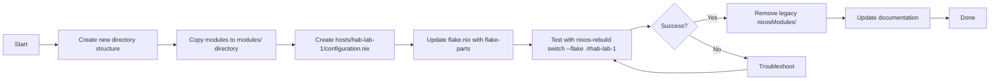

# NixOS Configuration Migration Plan
## From Monolithic Flake to Dendritic Pattern with flake-parts

---

## Table of Contents
1. [Current State](#current-state)
2. [Migration Goals](#migration-goals)
3. [Dendritic Pattern Overview](#dendritic-pattern-overview)
4. [Proposed Directory Structure](#proposed-directory-structure)
5. [Key File Examples](#key-file-examples)
6. [Migration Steps](#migration-steps)
7. [Recommendations](#recommendations)

---

## Current State

### Existing Configuration
| Component | File/Location |
|-----------|---------------|
| Flake | [`flake.nix`](flake.nix) - Single `nixosSystem` |
| Main Config | [`configuration.nix`](configuration.nix:1) - All services in one file |
| Disk Setup | [`disk-config.nix`](disk-config.nix:1) - Disko + ZFS |
| Hardware | [`hardware-configuration.nix`](hardware-configuration.nix:1) - Auto-generated |
| Modules | `nixosModules/` - 6 service modules |

### Current Services
- **Nextcloud** - Port 8080, data in `/tank`
- **Firefly III** - MySQL database, port 3306 via nginx
- **Immich** - Port 2283
- **Mealie** - Port 9000
- **Tailscale** - VPN service
- **Caddy** - Commented out

### Current Host
- **hab-lab-1** at `10.0.0.65`

---

## Migration Goals

1. Convert to flake-parts with dendritic patterns
2. Enable multi-host support (future hosts like `hab-atlas`, `pikvm`)
3. Better organize files to represent home lab infrastructure
4. Maintain all current services during migration
5. Preserve existing disk configuration approach

---

## Dendritic Pattern Overview

The dendritic pattern uses flake-parts to create a hierarchical structure:

```
hosts/          # Per-host configurations (leaf nodes)
modules/        # Shared, reusable modules (branch nodes)
flake.nix       # Root - orchestrates the tree
```

### Key Benefits
- **Scalable**: Add new hosts without touching shared configs
- **Reusable**: Modules can be shared across multiple hosts
- **Clear separation**: Network, disk, services, security are organized
- **Modern best practices**: Uses flake-parts for better organization

---

## Proposed Directory Structure

```
hab-nixos/
├── flake.nix                    # Main flake with flake-parts
├── flake.lock                   # Lock file (auto-generated)
├── README.md                    # Documentation for the new structure
├── MIGRATION_PLAN.md            # This file
│
├── hosts/                       # Per-host configurations (dendritic pattern)
│   ├── hab-lab-1/               # Current host
│   │   ├── configuration.nix    # Host-specific config
│   │   └── hardware-configuration.nix  # Optional: separate hardware config
│   └── future-host/             # Template for new hosts
│       └── configuration.nix
│
├── modules/                     # Shared, reusable modules (dendritic pattern)
│   ├── networking/
│   │   ├── default.nix          # Network settings aggregator
│   │   ├── tailscale.nix        # Tailscale module
│   │   └── firewall.nix         # Firewall rules
│   ├── disk/
│   │   ├── default.nix          # Disk configuration wrapper
│   │   └── disko-config.nix     # Disko partitions + ZFS
│   ├── services/
│   │   ├── default.nix          # Service modules aggregator
│   │   ├── nextcloud.nix        # Nextcloud module
│   │   ├── firefly-iii.nix      # Firefly III module
│   │   ├── immich.nix           # Immich module
│   │   └── mealie.nix           # Mealie module
│   ├── nginx/
│   │   ├── default.nix          # Nginx config wrapper
│   │   └── virtual-hosts.nix    # Virtual host definitions
│   ├── security/
│   │   ├── default.nix          # Security settings aggregator
│   │   ├── ssh.nix              # SSH configuration
│   │   └── fail2ban.nix         # Fail2Ban module (if used)
│   └── users/
│       ├── default.nix          # User management aggregator
│       └── hab-lab-user.nix     # hab-lab user config
│
└── nixosModules/                # Legacy modules (can be phased out)
    ├── caddy.nix
    ├── default.nix
    ├── firefly-iii.nix
    ├── immich.nix
    ├── mealie.nix
    ├── nextcloud.nix
    └── tailscale.nix
```

---

## Key File Examples

### 1. `flake.nix` - Flare Parts with Dendritic Pattern

```nix
{
  description = "HAB NixOS Configuration - Dendritic Pattern";

  inputs = {
    nixpkgs.url = "github:NixOS/nixpkgs/nixpkgs-unstable";
    flake-parts.url = "github:hercules-ci/flake-parts";
    disko.url = "github:nix-community/disko";
    disko.inputs.nixpkgs.follows = "nixpkgs";
  };

  outputs =
    inputs@{ self, nixpkgs, flake-parts, disko, ... }:
    flake-parts.lib.mkFlake { inherit inputs; } {
      systems = [ "x86_64-linux" ];

      # Per-host configurations
      perSystem = { config, self', inputs', pkgs, system, ... }: {
        # NixOS configurations for each host
        nixosConfigurations = {
          hab-lab-1 = nixpkgs.lib.nixosSystem {
            system = "x86_64-linux";
            modules = [
              disko.nixosModules.disko
              ./hosts/hab-lab-1/configuration.nix
            ];
          };
          
          # Template for future hosts
          # hab-atlas = nixpkgs.lib.nixosSystem {
          #   system = "x86_64-linux";
          #   modules = [
          #     disko.nixosModules.disko
          #     ./hosts/hab-atlas/configuration.nix
          #   ];
          # };
        };

        # Dev shell for convenience
        devShells.default = pkgs.mkShell {
          name = "hab-nixos-dev";
          packages = with pkgs; [
            nixpkgs-fmt
            statix
            deadnix
          ];
        };
      };
    };
}
```

### 2. `hosts/hab-lab-1/configuration.nix` - Host Configuration

```nix
{ config, pkgs, lib, modulesPath, ... }:

{
  # Import the dendritic module structure
  imports = [
    # Hardware configuration (can be separate or inlined)
    # ./hardware-configuration.nix
    
    # Disk configuration from modules/
    ../modules/disk/default.nix
    
    # Networking and Tailscale
    ../modules/networking/default.nix
    
    # User management
    ../modules/users/default.nix
    
    # All services
    ../modules/services/default.nix
    
    # Security settings
    ../modules/security/default.nix
  ];

  # System configuration
  nixpkgs.hostPlatform = "x86_64-linux";
  
  # System state version (do not change after initial install)
  system.stateVersion = "24.05";

  # Host-specific settings
  networking.hostName = "hab-lab-1";
  networking.domain = "lab";
  
  # Network interfaces
  networking.interfaces.eno1.useDHCP = true;
  
  # Time zone and locale
  time.timeZone = "America/New_York";
  i18n.defaultLocale = "en_US.UTF-8";
}
```

### 3. `modules/disk/default.nix` - Disk Module

```nix
{ lib, ... }:

{
  imports = [
    ./disko-config.nix
  ];

  # Export disk configuration for use in other modules
  options.modules.disk = {
    enabled = lib.mkOption {
      type = lib.types.bool;
      default = true;
      description = "Enable disk configuration";
    };
  };

  config = lib.mkIf config.modules.disk.enabled {
    # Disk configuration is imported from disko-config.nix
  };
}
```

### 4. `modules/services/default.nix` - Services Module

```nix
{ self, config, pkgs, lib, ... }:

{
  imports = [
    ./nextcloud.nix
    ./firefly-iii.nix
    ./immich.nix
    ./mealie.nix
    ./nginx/default.nix
  ];

  # Host-specific settings for services
  networking.firewall.allowedTCPPorts = [
    80   # HTTP
    443  # HTTPS (when enabled)
    8080 # Nextcloud
    2283 # Immich
    9000 # Mealie
  ];

  # Nginx virtual hosts configuration
  services.nginx.virtualHosts = {
    "10.0.0.65" = {
      forceSSL = false;
      listen = [
        { addr = "10.0.0.65"; port = 8080; }
      ];
    };
    
    "immich.10.0.0.65.nip.io" = {
      forceSSL = false;
      listen = [
        { addr = "10.0.0.65"; port = 2283; }
      ];
    };
    
    "mealie.10.0.0.65.nip.io" = {
      forceSSL = false;
      listen = [
        { addr = "10.0.0.65"; port = 9000; }
      ];
    };
  };
}
```

---

## Migration Steps



### Step-by-Step Migration

1. **Create new directory structure**
   ```bash
   mkdir -p hosts/hab-lab-1 modules/{networking,disk,services,security,users}
   ```

2. **Copy existing modules to new structure** (preserving functionality)

3. **Create host configuration** with imports from modules

4. **Update flake.nix** to use flake-parts and point to new structure

5. **Test incrementally**:
   ```bash
   nixos-rebuild switch --flake .#hab-lab-1
   ```

6. **Phase out legacy modules** once migration is complete

---

## Recommendations for Shared vs Host-Specific Configs

| Category | Location | Example |
|----------|----------|---------|
| **Host-specific** | `hosts/<hostname>/` | Hostname, IP addresses, unique services |
| **Shared network** | `modules/networking/` | Tailscale, firewall rules |
| **Shared disk** | `modules/disk/` | Disk partitions, ZFS pools |
| **Shared services** | `modules/services/` | Nextcloud, Firefly III, etc. |
| **Security** | `modules/security/` | Fail2Ban, SSH settings |

### Best Practices

1. **Keep host-specific configs minimal** - Only put hostname, IP, and unique settings in `hosts/<hostname>/`

2. **Make modules reusable** - Use `lib.mkOption` with defaults for configurable aspects

3. **Document each module** - Add descriptions to options using `description` field

4. **Test before committing** - Use `nixos-rebuild test --flake .#<hostname>` first

5. **Version state changes carefully** - Only update `system.stateVersion` when necessary

---

## Adding Future Hosts

To add a new host (e.g., `hab-atlas`):

1. Create directory: `mkdir hosts/hab-atlas`

2. Copy hardware config from existing host or create new one

3. Create `hosts/hab-atlas/configuration.nix`:
   ```nix
   { config, pkgs, ... }:
   
   {
     imports = [
       ../modules/disk/default.nix
       ../modules/networking/default.nix
       ../modules/users/default.nix
       ../modules/services/default.nix
     ];
     
     networking.hostName = "hab-atlas";
     # Additional host-specific settings...
   }
   ```

4. Add to `flake.nix`:
   ```nix
   hab-atlas = nixpkgs.lib.nixosSystem {
     system = "x86_64-linux";
     modules = [
       disko.nixosModules.disko
       ./hosts/hab-atlas/configuration.nix
     ];
   };
   ```

5. Test: `nixos-rebuild switch --flake .#hab-atlas`