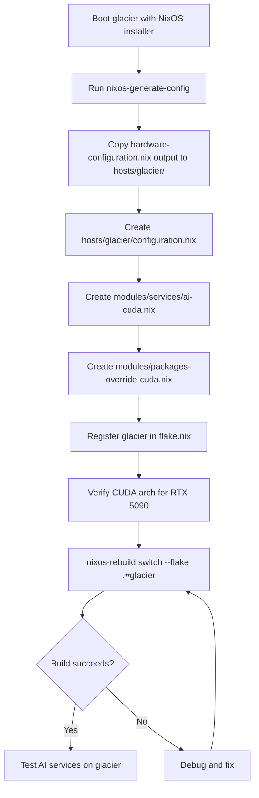

# Plan: Adding "glacier" Host to hab-nixos

## Overview

Add a new NixOS host named **glacier** to the repository. Glacier is a desktop machine with an AMD CPU and an NVIDIA RTX 5090 GPU. It shares most of its configuration with **warframe** (the existing laptop host) but differs in:

- Desktop environment: KDE Plasma 6 only (no Hyprland)
- GPU: NVIDIA 5090 (CUDA) instead of AMD (ROCm)
- AI services: CUDA-based llama-cpp/llama-swap instead of ROCm
- Package overrides: NVIDIA/CUDA-specific build flags

---

## Repository Structure After Implementation

```
hab-nixos/
├── flake.nix                              # Updated: glacier added to nixosConfigurations
├── hosts/
│   ├── warframe/                          # Unchanged
│   │   ├── configuration.nix
│   │   └── hardware-configuration.nix
│   └── glacier/                           # NEW
│       ├── configuration.nix              # NEW: glacier host config
│       └── hardware-configuration.nix     # NEW: generated by nixos-generate-config
└── modules/
    ├── packages-override.nix              # Unchanged (warframe/ROCm)
    ├── packages-override-cuda.nix         # NEW: glacier/CUDA variant
    └── services/
        ├── ai.nix                         # Unchanged (warframe/ROCm)
        └── ai-cuda.nix                    # NEW: glacier/CUDA variant
```

---

## Shared Modules (Unchanged from warframe)

Glacier will import the same modules as warframe where applicable:

| Module | Path | Notes |
|--------|------|-------|
| ZFS disk support | `modules/disk/zfs.nix` | Same as warframe |
| Bluetooth | `modules/networking/bluetooth.nix` | Same as warframe |
| WiFi | `modules/networking/wifi.nix` | Same as warframe |
| Tailscale | `modules/networking/tailscale.nix` | Same as warframe |
| KDE Plasma 6 | `modules/desktop/plasma6-xserver.nix` | Same as warframe |
| User: zman | `modules/users/zman/zman.nix` | Same as warframe |
| Apps | `modules/apps/default.nix` | Same as warframe |

---

## New Files to Create

### 1. `hosts/glacier/hardware-configuration.nix`

This file is **generated by `nixos-generate-config`** on the physical machine. It cannot be written in advance. A placeholder should be created with instructions.

Key differences expected from warframe's hardware config:
- `boot.kernelModules` will include `kvm-amd` (same as warframe)
- `boot.initrd.availableKernelModules` will differ based on actual hardware
- `fileSystems` will have different UUIDs
- NVIDIA kernel module loading will be handled via `hardware.nvidia` options in `configuration.nix`

**Placeholder content:**
```nix
# PLACEHOLDER: Replace this file with the output of:
#   nixos-generate-config --show-hardware-config
# Run on the glacier machine after booting a NixOS installer.
{ config, lib, pkgs, modulesPath, ... }:
{
  imports = [ (modulesPath + "/installer/scan/not-detected.nix") ];
  # TODO: Fill in from nixos-generate-config output
}
```

---

### 2. `hosts/glacier/configuration.nix`

Based on `hosts/warframe/configuration.nix` with the following changes:

**Shared with warframe:**
- Boot loader (systemd-boot + EFI)
- ZFS disk module
- Networking modules (bluetooth, wifi, tailscale)
- User module (zman)
- Apps module
- Locale/timezone settings
- `nixpkgs.config.allowUnfree = true`
- `nix.settings.experimental-features`
- `system.stateVersion = "24.11"`

**Different from warframe:**
- `networking.hostName = "glacier"` (unique hostId also needed)
- Desktop: only `plasma6-xserver.nix` (no hyprland import)
- AI services: `../../modules/services/ai-cuda.nix` instead of `ai.nix`
- Package overrides: `../../modules/packages-override-cuda.nix` instead of `packages-override.nix`
- NVIDIA GPU configuration via `hardware.nvidia` options
- `hardware.cpu.amd.updateMicrocode` (same as warframe, AMD CPU)

**Key NVIDIA configuration to add:**
```nix
# NVIDIA GPU support
hardware.nvidia = {
  modesetting.enable = true;
  powerManagement.enable = false;
  powerManagement.finegrained = false;
  open = false;           # Use proprietary driver (recommended for 5090)
  nvidiaSettings = true;
  package = config.boot.kernelPackages.nvidiaPackages.stable;
};
services.xserver.videoDrivers = [ "nvidia" ];
hardware.graphics.enable = true;
```

**Unique hostId:** Generate a new unique 8-character hex hostId (required for ZFS). Use:
```bash
head -c 8 /etc/machine-id
# or
printf "%08x" $(date +%s)
```

**Full configuration.nix outline:**
```nix
# Main configuration for glacier desktop
# Build commands:
#   Local build:  nixos-rebuild switch --flake .#glacier
#   Remote build: nixos-rebuild switch --flake .#glacier --target-host zman@<glacier-ip>
{ config, lib, pkgs, modulesPath, ... }:

{
  imports = [
    (modulesPath + "/installer/scan/not-detected.nix")
    ./hardware-configuration.nix

    # Dendritic module structure
    ../../modules/disk/zfs.nix

    ../../modules/networking/bluetooth.nix
    ../../modules/networking/wifi.nix
    ../../modules/networking/tailscale.nix

    ../../modules/desktop/plasma6-xserver.nix
    # NOTE: No Hyprland on glacier

    ../../modules/users/zman/zman.nix

    ../../modules/apps/default.nix
    ../../modules/services/ai-cuda.nix        # CUDA variant
    ../../modules/packages-override-cuda.nix  # CUDA variant
  ];

  # Boot configuration
  boot.loader.systemd-boot.enable = true;
  boot.loader.efi.canTouchEfiVariables = true;

  networking.hostName = "glacier";
  networking.hostId = "<GENERATE_NEW_ID>";  # Must be unique for ZFS
  networking.useDHCP = lib.mkDefault true;

  nixpkgs.hostPlatform = lib.mkDefault "x86_64-linux";
  hardware.cpu.amd.updateMicrocode = lib.mkDefault config.hardware.enableRedistributableFirmware;

  # NVIDIA GPU support
  hardware.nvidia = {
    modesetting.enable = true;
    powerManagement.enable = false;
    powerManagement.finegrained = false;
    open = false;
    nvidiaSettings = true;
    package = config.boot.kernelPackages.nvidiaPackages.stable;
  };
  services.xserver.videoDrivers = [ "nvidia" ];
  hardware.graphics.enable = true;

  nixpkgs.config.allowUnfree = true;

  environment.systemPackages = map lib.lowPrio [
    pkgs.curl
    pkgs.gitMinimal
  ];

  nix.settings.experimental-features = [ "nix-command" "flakes" ];

  time.timeZone = "America/New_York";
  i18n.defaultLocale = "en_US.UTF-8";
  i18n.extraLocaleSettings = {
    LC_ADDRESS = "en_US.UTF-8";
    LC_IDENTIFICATION = "en_US.UTF-8";
    LC_MEASUREMENT = "en_US.UTF-8";
    LC_MONETARY = "en_US.UTF-8";
    LC_NAME = "en_US.UTF-8";
    LC_NUMERIC = "en_US.UTF-8";
    LC_PAPER = "en_US.UTF-8";
    LC_TELEPHONE = "en_US.UTF-8";
    LC_TIME = "en_US.UTF-8";
  };

  system.stateVersion = "24.11";
}
```

---

### 3. `modules/services/ai-cuda.nix`

A CUDA-adapted version of `modules/services/ai.nix`. Key differences:

| Aspect | warframe (ai.nix / ROCm) | glacier (ai-cuda.nix / CUDA) |
|--------|--------------------------|------------------------------|
| GPU runtime | ROCm packages | CUDA (via nixpkgs CUDA support) |
| llama-cpp build | `rocmSupport = true` | `cudaSupport = true` |
| GPU target flag | `-DAMDGPU_TARGETS=gfx1102` | `-DCMAKE_CUDA_ARCHITECTURES=<sm_for_5090>` |
| Extra packages | `rocmPackages.*` | `cudaPackages.*` |
| Env vars | `ROCM_PATH`, `HIP_VISIBLE_DEVICES` | `CUDA_VISIBLE_DEVICES` |

**NVIDIA 5090 CUDA Architecture:** The RTX 5090 uses the Blackwell architecture. The CUDA compute capability is expected to be `sm_100` (or similar - verify at implementation time from NVIDIA docs or `nvidia-smi`).

**Outline of ai-cuda.nix:**
```nix
# AI and machine learning services - CUDA/NVIDIA variant
# For use with glacier (NVIDIA RTX 5090)
{ pkgs, ... }:

let
  llama-cpp-cuda = pkgs.llama-cpp.override { cudaSupport = true; };
in
{
  hardware.graphics = {
    enable = true;
    extraPackages = with pkgs; [
      # CUDA runtime is handled by hardware.nvidia, not extraPackages
    ];
  };

  environment.systemPackages = with pkgs; [
    cudaPackages.cuda_nvcc
    nvtopPackages.nvidia
  ];

  environment.variables = {
    CUDA_VISIBLE_DEVICES = "0";
  };

  # llama-swap config (same structure as ai.nix, different llama-cpp binary)
  environment.etc."llama-swap/config.yaml".text = ''
    models:
      "qwen3.5:35b-a3b-q4":
        cmd: |
          ${llama-cpp-cuda}/bin/llama-server
          -hf unsloth/Qwen3.5-35B-A3B-GGUF:UD-Q4_K_XL
          --port ''${PORT}
          --ctx-size 65536
          --batch-size 2048
          --ubatch-size 512
          --threads 1
          --jinja

    healthCheckTimeout: 28800
    ttl: 3600
  '';

  systemd.services.llama-swap = {
    # ... same structure as ai.nix but with CUDA env vars
    serviceConfig = {
      Environment = [
        "CUDA_VISIBLE_DEVICES=0"
      ];
      # ... rest same as ai.nix
    };
  };
}
```

---

### 4. `modules/packages-override-cuda.nix`

A CUDA-adapted version of `modules/packages-override.nix`. Key differences:

| Aspect | warframe (ROCm) | glacier (CUDA) |
|--------|-----------------|----------------|
| `cudaSupport` | `false` | `true` |
| `rocmSupport` | `true` | `false` |
| `cmakeFlags` GPU target | `-DAMDGPU_TARGETS=gfx1102` | `-DCMAKE_CUDA_ARCHITECTURES=<sm_for_5090>` |
| `nixpkgs.config.cudaSupport` | `false` | `true` |

**Outline:**
```nix
{ pkgs, ... }:

{
  nixpkgs.config = {
    cudaSupport = true;
    packageOverrides = pkgs: {
      llama-cpp =
        (pkgs.llama-cpp.override {
          cudaSupport = true;
          rocmSupport = false;
          metalSupport = false;
          blasSupport = true;
        }).overrideAttrs
          (oldAttrs: rec {
            version = "8204";  # Keep in sync with packages-override.nix
            src = pkgs.fetchFromGitHub {
              owner = "ggml-org";
              repo = "llama.cpp";
              tag = "b${version}";
              hash = "sha256-j3RLNiY6u36qdLah4Zcrac804Ub1wnBtv066PtzBvt0=";
              leaveDotGit = true;
              postFetch = ''
                git -C "$out" rev-parse --short HEAD > $out/COMMIT
                find "$out" -name .git -print0 | xargs -0 rm -rf
              '';
            };
            npmDepsHash = "sha256-FKjoZTKm0ddoVdpxzYrRUmTiuafEfbKc4UD2fz2fb8A=";
            cmakeFlags = (oldAttrs.cmakeFlags or []) ++ [
              "-DGGML_NATIVE=ON"
              "-DCMAKE_CUDA_ARCHITECTURES=<SM_FOR_5090>"  # Verify at implementation
            ];
            preConfigure = ''
              export NIX_ENFORCE_NO_NATIVE=0
              ${oldAttrs.preConfigure or ""}
            '';
          });

      # llama-swap binary (same as packages-override.nix)
      llama-swap = pkgs.runCommand "llama-swap" { } ''
        mkdir -p $out/bin
        tar -xzf ${
          pkgs.fetchurl {
            url = "https://github.com/mostlygeek/llama-swap/releases/download/v197/llama-swap_197_linux_amd64.tar.gz";
            hash = "sha256-GOP31onCrHvwvutsDXJV0uj+EKKaQdmZfiaBS0tX7Co=";
          }
        } -C $out/bin
        chmod +x $out/bin/llama-swap
      '';
    };
  };
}
```

---

### 5. `flake.nix` Update

Add glacier to the `nixosConfigurations` attrset:

```nix
glacier = nixpkgs.lib.nixosSystem {
  system = "x86_64-linux";
  modules = [
    ./hosts/glacier/configuration.nix
  ];
};
```

Note: No `disko.nixosModules.disko` needed unless glacier uses disko for disk management (warframe doesn't use it either).

---

## Implementation Steps (Ordered)



### Step-by-Step

1. **Boot glacier** with a NixOS installer USB

2. **Generate hardware config** on the glacier machine:
   ```bash
   nixos-generate-config --show-hardware-config
   ```
   Copy the output into `hosts/glacier/hardware-configuration.nix`

3. **Generate a unique hostId** for ZFS (must be unique across all hosts):
   ```bash
   head -c 8 /etc/machine-id
   ```
   Current hostIds in use:
   - `hab-lab`: `007f0201`
   - `warframe`: `007f0208`

4. **Create `hosts/glacier/configuration.nix`** following the outline above

5. **Create `modules/services/ai-cuda.nix`** following the outline above
   - Verify the CUDA compute capability for RTX 5090 (expected `sm_100` for Blackwell)

6. **Create `modules/packages-override-cuda.nix`** following the outline above
   - Set the correct `-DCMAKE_CUDA_ARCHITECTURES` value for RTX 5090

7. **Update `flake.nix`** to add glacier to `nixosConfigurations`

8. **Build and test**:
   ```bash
   # Test without switching (dry run)
   nixos-rebuild test --flake .#glacier

   # Apply configuration
   nixos-rebuild switch --flake .#glacier
   ```

---

## Key Decisions & Notes

### NVIDIA RTX 5090 CUDA Architecture
- The RTX 5090 is a Blackwell-generation GPU
- Expected CUDA compute capability: `sm_100` (verify with `nvidia-smi` or NVIDIA docs at implementation time)
- The `cmakeFlags` in `packages-override-cuda.nix` must use the correct value

### NVIDIA Driver in NixOS
- Use `hardware.nvidia.open = false` (proprietary driver) for best 5090 support
- The `nixpkgs.config.allowUnfree = true` is already planned (same as warframe)
- `services.xserver.videoDrivers = [ "nvidia" ]` is required for X11/KDE Plasma

### ZFS hostId
- Every ZFS host **must** have a unique `networking.hostId`
- Generate one that doesn't conflict with `007f0201` (hab-lab) or `007f0208` (warframe)

### Hyprland Exclusion
- Unlike warframe, glacier does **not** import `modules/desktop/hyprland-wayland.nix`
- This simplifies the desktop config (no `modules.desktop.hyprland.enable = false` needed)

### llama-swap Binary
- The `llama-swap` binary in `packages-override-cuda.nix` is the same pre-built binary as warframe (architecture-independent Go binary)
- No changes needed to the llama-swap fetch URL/hash

### home-manager
- Like warframe, home-manager integration is commented out for now
- The `modules/users/zman/zman.nix` module handles user setup directly

---

## Files Summary

| File | Action | Based On |
|------|--------|----------|
| `hosts/glacier/hardware-configuration.nix` | CREATE (from nixos-generate-config) | Machine-specific |
| `hosts/glacier/configuration.nix` | CREATE | `hosts/warframe/configuration.nix` |
| `modules/services/ai-cuda.nix` | CREATE | `modules/services/ai.nix` |
| `modules/packages-override-cuda.nix` | CREATE | `modules/packages-override.nix` |
| `flake.nix` | MODIFY | Add glacier entry |
| `hosts/warframe/configuration.nix` | UNCHANGED | - |
| `modules/packages-override.nix` | UNCHANGED | - |
| `modules/services/ai.nix` | UNCHANGED | - |
