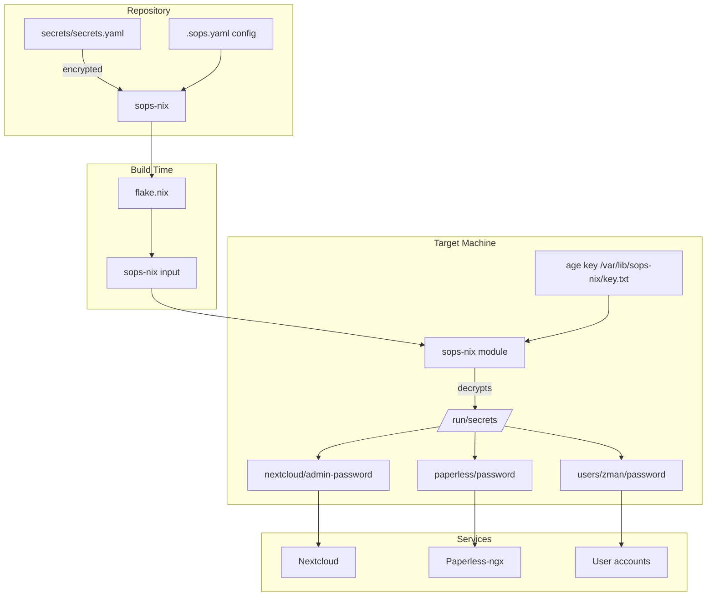

# Sops-nix Implementation Plan

## Overview

This plan outlines the implementation of `sops-nix` for secure secrets management in your NixOS configuration. Sops-nix encrypts secrets at rest using age or GPG encryption and decrypts them at activation time, keeping secrets out of the Nix store and version control history.

## Why Sops-nix?

### Current Security Issues

1. **Nextcloud admin password** - Hardcoded in [`modules/services/nextcloud.nix`](modules/services/nextcloud.nix:5):
   ```nix
   environment.etc."nextcloudadminpass".text = "testpassword";
   ```

2. **User hashed passwords** - Visible in [`hosts/hab-lab/configuration.nix`](hosts/hab-lab/configuration.nix:80):
   ```nix
   initialHashedPassword = "$y$j9T$RbcN4mdZop6gD9K4x07AH/$XKRWxzJnp8gJM3UF/W8p8DwvC4EADEAsvxFU0KDCbw7";
   ```

3. **Paperless-ngx** - Commented `passwordFile` option awaiting secret management

4. **Firefly-III** - Commented out due to missing secret management

### Benefits of Sops-nix

- Secrets encrypted at rest in your repository
- Decrypted only on target machines at activation
- Never stored in world-readable `/nix/store`
- Supports both age and GPG encryption
- Works with both NixOS and home-manager

## Architecture



## File Structure

```
hab-nixos/
├── .sops.yaml                    # Sops configuration - age keys
├── secrets/
│   ├── secrets.yaml              # Encrypted secrets file
│   └── templates/
│       └── secrets.example.yaml  # Template showing structure
├── modules/
│   └── secrets/
│       └── sops.nix              # Sops-nix configuration module
└── hosts/
    ├── hab-lab/
    │   └── secrets.nix            # Host-specific secret imports
    └── warframe/
        └── secrets.nix            # Host-specific secret imports
```

## Implementation Steps

### Step 1: Add sops-nix Input to Flake

Update [`flake.nix`](flake.nix) to include sops-nix:

```nix
inputs = {
  nixpkgs.url = "github:NixOS/nixpkgs/nixpkgs-unstable";
  disko.url = "github:nix-community/disko";
  disko.inputs.nixpkgs.follows = "nixpkgs";
  home-manager = {
    url = "github:nix-community/home-manager";
    inputs.nixpkgs.follows = "nixpkgs";
  };
  sops-nix = {
    url = "github:Mic92/sops-nix";
    inputs.nixpkgs.follows = "nixpkgs";
  };
};
```

### Step 2: Create Sops Configuration Module

Create [`modules/secrets/sops.nix`](modules/secrets/sops.nix) with:

- Default age key location
- Secret generation helper functions
- Common secret paths

### Step 3: Generate Age Keys

Each host needs an age key for decryption. Generate with:

```bash
# Generate a new age key
nix-shell -p age --run "age-keygen -o ~/.config/sops/age/keys.txt"

# Extract the public key
nix-shell -p age --run "age-keygen -y ~/.config/sops/age/keys.txt"
```

### Step 4: Create .sops.yaml Configuration

```yaml
keys:
  - &hab-lab age1...  # Public key for hab-lab
  - &warframe age1... # Public key for warframe
  
creation_rules:
  - path_regex: secrets/.*\.yaml$
    key_groups:
    - age:
      - *hab-lab
      - *warframe
```

### Step 5: Create Encrypted Secrets File

Create `secrets/secrets.yaml` with structure:

```yaml
nextcloud:
  admin-password: "your-secure-password"
  
paperless:
  password: "your-paperless-password"
  
users:
  zman:
    hashed-password: "$y$j9T$..."
  hab-lab:
    hashed-password: "$y$j9T$..."
    
firefly:
  app-key: "base64-encoded-key"
  db-password: "database-password"
```

Encrypt with:

```bash
nix-shell -p sops --run "sops secrets/secrets.yaml"
```

### Step 6: Update Service Modules

#### Nextcloud Module Changes

```nix
# Before
environment.etc."nextcloudadminpass".text = "testpassword";

# After
sops.secrets."nextcloud/admin-password" = {
  owner = config.services.nextcloud.user;
};

services.nextcloud.config.adminpassFile = 
  config.sops.secrets."nextcloud/admin-password".path;
```

#### Paperless-ngx Module Changes

```nix
# Add passwordFile option
sops.secrets."paperless/password" = {
  owner = config.services.paperless.user;
};

services.paperless.passwordFile = 
  config.sops.secrets."paperless/password".path;
```

### Step 7: Update User Configuration

```nix
# Before
users.users.root.initialHashedPassword = "...";

# After
sops.secrets."users/root/hashed-password" = {};
users.users.root.hashedPasswordFile = 
  config.sops.secrets."users/root/hashed-password".path;
```

## Security Considerations

### Age Key Management

1. **Location**: Age keys stored at `/var/lib/sops-nix/key.txt` on each host
2. **Generation**: Keys generated on first deployment or manually
3. **Backup**: Private keys should be backed up securely offline
4. **Rotation**: Keys can be rotated by re-encrypting secrets

### Secret Access

- Secrets decrypted to `/run/secrets/` with restricted permissions
- Each secret has owner/group configurable
- Secrets never appear in `/nix/store`

### Git Security

- `.gitignore` must include `secrets/*.yaml` but NOT `.sops.yaml`
- Consider using git-crypt for additional layer
- Never commit unencrypted secrets

## Testing Strategy

1. **Build Test**: `nixos-rebuild build --flake .#hab-lab`
2. **Activation Test**: Deploy and verify secrets appear in `/run/secrets/`
3. **Service Test**: Verify services can read their secrets
4. **Reboot Test**: Verify secrets persist across reboots

## Rollback Plan

If issues arise:
1. Keep old password files as backup initially
2. Sops-nix is non-destructive - old configs still work
3. Can disable sops-nix module and revert to file-based secrets

## Questions for Clarification

Before implementation, I need to understand:

1. **Age vs GPG**: Do you prefer age encryption (simpler) or GPG (if you already use GPG keys)?

2. **Key Distribution**: Should both hosts share the same age key for simplicity, or have separate keys for better security isolation?

3. **Secret Storage**: Do you want secrets in a single `secrets.yaml` file or split by service?

4. **Existing Passwords**: Should I preserve the current hashed passwords, or generate new ones?

5. **Home Manager Integration**: Do you plan to use sops-nix with home-manager for user-level secrets?

## Next Steps

Once you approve this plan and answer the clarifying questions, I will:

1. Create the sops-nix module
2. Update flake.nix with the sops-nix input
3. Create the .sops.yaml configuration
4. Update each service module to use sops secrets
5. Create documentation for adding new secrets